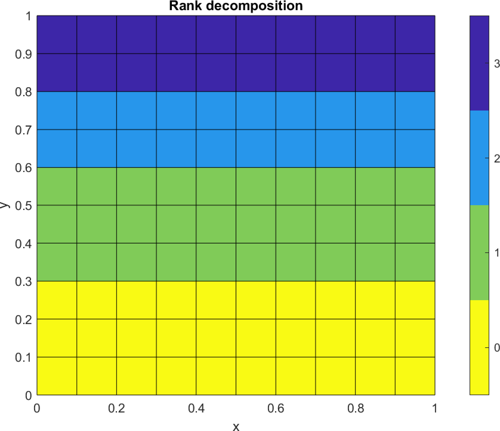

# A parallel solver for the Laplace equation using Python

## Introduction

Consider solving the Laplace equation, which models heat diffusion over a square domain with preset temperatures along the boundaries:

$$
\left\\{
\begin{aligned}
-\Delta u & = 0, & \quad & \text{in } \Omega = (0, 1)^2, \\
u & = 1, & \quad & \text{on } \\{x=0, x=1\\}, \\
u & = 1, & \quad & \text{on } \\{y=0\\}, \\
u & = 10, & \quad & \text{on } \\{y=1\\},
\end{aligned}
\right.
$$

The challenge is to solve this equation using the Jacobi iteration method on a discretized domain.

## Approach

Represent the solution as a matrix $U$ of size $n \times n$, initialized with zeroes except at the boundaries which are set according to the conditions above.

### Algorithm
For $k = 1, \dots$ until convergence:

1. Each internal entry of $U$ is updated as the average of its four-point stencil's values:

$$
U^{(k+1)}(i, j) = \frac{1}{4}(U^{(k)}(i - 1, j) + U^{(k)}(i + 1, j) + U^{(k)}(i, j - 1) + U^{(k)}(i, j + 1)), \quad \forall i, j = 2, \dots, n - 1.
$$

2. Continue iterating until the error $\left\lVert U^{(k+1)} - U^{(k)} \right\rVert$ is below a specified tolerance.

## Parallel implementation with Python and mpi4py

Implement the solver in Python using the `mpi4py` package:

- **Matrix distribution**: Distribute the matrix rows across MPI processes to ensure each has approximately the same number of rows (see figure below).
- **Data exchange**: Implement mechanisms for processes to exchange boundary row data crucial for updating the matrix edges.
- **Convergence check**: Each process should independently check for convergence locally and then collectively determine if all processes have met the criterion.
- **(Bonus)**: Provide a GPU-accelerated version of the parallel Jacobi algorithm and compare the results.

## Visualization and performance testing
- Demonstrate the solver's efficacy by plotting the computed solution.
- Assess the performance gains of the parallel solver compared to a serial implementation as the matrix size scales from small to very large (e.g., $n = 8$ to $n = 1024$).

## Deliverables
Submit your solution as a `.zip` file containing:
- Python source code using `mpi4py` and/or `cupy`.
- Dependencies and environment requirements, if any, in a `requirements.txt` file.
- A `README.md` providing setup and execution instructions.
- Visual plots of the solution.
- Performance analysis charts detailing speed-ups and efficiency gains.
