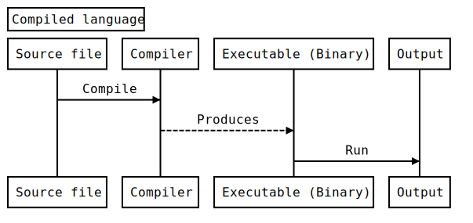
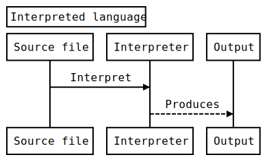
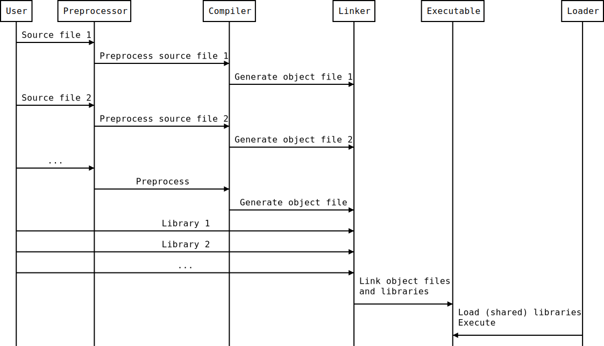

<!--
title: Lecture 01
paginate: true

_class: titlepage
-->

# Lecture 01
<br>

## A day in the life of a software developer
<br>

#### High Performance Computing for Data Science - SISSA, UniTS, 2023-2024

###### Pasquale Claudio Africa, Konstantin Karchev

###### 22 Apr 2024

---

<!--
_class: titlepage
-->

# Course overview

---

# Practical info
- **Instructor**: Pasquale Claudio Africa <pafrica@sissa.it>
- **Assistant**: Konstantin Karchev <kkarchev@sissa.it>

# Course material
- [GitHub](https://github.com/pcafrica/hpc_for_data_science_2023-2024): timetable, lecture notes and slides, exercise sessions.
- Books (see course syllabus):
  1. *Parallel and High Performance Programming with Python*, Fabio Nelly.
  2. *Python Parallel Programming Cookbook*, Giancarlo Zaccone.
  3. *High Performance Python: Practical Performant Programming for Humans*, Micha Gorelick & Ian Ozvald.

- Internet (plenty of free or paid resources).

---

# Practical info

Lectures at SISSA, room 003. Check out - [GitHub](https://github.com/pcafrica/hpc_for_data_science_2023-2024) regularly for up-to-date timetable, lecture topics, and course material.

Course balance (approximate):
- 16 hours (2CFUs).
- Frontal lectures: **50%**, practical sessions: **50%**.

For practical sessions please **bring your own laptop**.

# Questions?
- Use [Discussions](https://github.com/pcafrica/hpc_for_data_science_2023-2024/discussions) on GitHub.
- Engage with each other!
- **Office hours**: send an email to book a session.

---

# Objectives and expectations
- **Part 1**
  - The UNIX shell and the software build process. Best practices for writing reliable code: error handling, unit testing, and software documentation.
- **Part 2**:
  - Scientific data and efficient computing, code profiling and optimization.
- **Part 3**:
  - Parallel and high-performance computing.

# Required skills
- Former knowledge of programming fundamentals (syntax, data types, variables, control structures, functions).
- Prior experience with C, C++, Java, or Python, is **recommended**, not mandatory.

---

# Laptop configuration

Please **bring your own laptop** with a working UNIX/Linux environment, whether standalone, dual boot, or virtualized.

For beginners: https://ubuntu.com/tutorials/install-ubuntu-desktop.
 
You can write code using any **text editor** (such as Emacs, Vim, or Nano), or an Integrated Development Environment (**IDE**) (such as VSCode, Eclipse, or Spyder).

# Requirements
- Python 3. The presence of Jupyter and conda is recommended.
- A C++ compiler installed with full support for C++17, such as GCC 10 or newer, or Clang 11 or newer. The presence of CMake is recommended.
- [Docker Desktop](https://www.docker.com/products/docker-desktop/). Please follow the instruction on the [official guide](https://docs.docker.com/get-docker/) and the [post-installation steps](https://docs.docker.com/engine/install/linux-postinstall/) thoroughly.

Any recent Linux distribution, such as Ubuntu $\geq$ 22.04, or Debian $\geq$ 11, or macOS system that meets these requirements should be suitable for the course.

---

# Windows users
- [Windows Subsystem for Linux (WSL2)](https://learn.microsoft.com/en-us/windows/wsl/install). Ubuntu version recommended, then follow Ubuntu-specific instructions.
- Virtual machine (such as [VirtualBox](https://www.virtualbox.org/)).
- (**Expert users**) [Dual boot](https://www.xda-developers.com/dual-boot-windows-11-linux/).

# macOS users
- [Xcode](https://developer.apple.com/xcode/): provides Clang.
- [Homebrew](https://brew.sh/): provides GCC, Clang, Python 3.

# Linux users
- Install Python 3 and GCC using your package manager (such as apt, yum, pacman).

---

# Popularity of programming languages
<br>


<br>

Source: https://pypl.github.io/PYPL.html

---

# Curated lists of awesome C++ and Python frameworks, libraries, resources, and shiny things.
<br><br>

- ## [awesome-cpp](https://github.com/fffaraz/awesome-cpp)
- ## [awesome-python](https://github.com/vinta/awesome-python)
- ## [awesome-scientific-python](https://github.com/rossant/awesome-scientific-python)
- ## [awesome-scientific-computing](https://github.com/nschloe/awesome-scientific-computing)

---

# Outline

1. The build process:
   - Compiled vs. interpreted languages.
   - Preprocessor, compiler, linker, loader.
2. Introduction to the UNIX shell:
   - What is a shell.
   - Variables.
   - Basic commands and scripting.
3. Introduction to `git`:
   - Local vs. remote.
   - Branching and collaborative working.
   - Sync the course material with your computer.
4. The Python ecosystem.

---

<!--
_class: titlepage
-->

# The build process:<br>Preprocessor, Compiler, Linker, Loader

---

# Compiled vs. interpreted languages




---

# The build process



---

# Preprocessor
- Handles directives and macros before compilation.
- Originated for code reusability and organization.

### Preprocessor directives
- `#include`: Includes header files.
- `#define`: Defines macros for code replacement.
- `#ifdef`, `#ifndef`, `#else`, `#endif`: Conditional compilation.
- `#pragma`: Compiler-specific directives.

### Macros
- Example: `#define SQUARE(x) ((x) * (x))`
- Usage: `int result = SQUARE(5); // Expands to: ((5) * (5))`

---

# Compiler
- Translates source code into assembly/machine code.
- Evolved with programming languages and instructions.

### Compilation process
1. Lexical analysis: Tokenization.
2. Syntax analysis (parsing): Syntax tree.
3. Semantic analysis: Checking.
4. Code generation: Assembly/machine code.
5. Optimization: Efficiency improvement.
6. Output: Object files.

### Common compiler options
`-O`: Optimization levels; `-g`: Debugging info; `-std`: C++ standard.

---

# Linker
- Combines object files into an executable.
- Supports modular code.

### Linking process
1. Symbol resolution: Match symbols.
2. Relocation: Adjust addresses.
3. Output: Executable.
4. Linker errors/warnings.
5. Example: `g++ main.o helper.o -o my_program`

### Static vs. dynamic linking
- Static: Larger binary, library inclusion.
- Dynamic: Smaller binary, runtime library reference.

---

# Loader
- Loads executables for execution.
- Tied to memory management evolution.

### Loading process
1. Memory allocation: Reserve memory.
2. Relocation: Adjust addresses.
3. Initialization: Set up environment.
4. Execution: Start execution.

### Dynamic linking at runtime
- Inclusion of external libraries during execution.
- Enhances flexibility.

---

<!--
_class: titlepage
-->

# Introduction to the UNIX shell

---

# What is a shell?


From [http://www.linfo.org/shell.html](http://www.linfo.org/shell.html):

> A shell is a program that provides the traditional, text-only user interface for Linux and other UNIX-like operating systems. Its primary function is to read commands that are typed into a console [...] and then execute (i.e., run) them. The term shell derives its name from the fact that it is an outer layer of an operating system. A shell is an interface between the user and the internal parts of the OS (at the very core of which is the kernel).

---

# What is `Bash`?

`Bash` stands for: `Bourne Again Shell`, a homage to its creator Stephen Bourne. It is the default shell for most UNIX systems and Linux distributions. It is both a command interpreter and a scripting language. The shell might be changed by simply typing its name and even the default shell might be changed for all sessions.

macOS has replaced it with [zsh](https://support.apple.com/en-us/HT208050), which is mostly compatible with `Bash`, since v10.15 Catalina.

Other shells available: tsh, ksh, csh, Dash, Fish, Windows PowerShell, ...

---

# Variables and environmental variables

As shell is a program, it has its variables. You can assign a value to a variable with the equal sign **(no spaces!)**, for instance type `A=1`. You can then retrieve its value using the dollar sign and curly braces, for instance to display it the user may type `echo ${A}`. Some variables can affect the way running processes will behave on a computer, these are called **environmental variables**. For this reason, some variables are set by default, for instance to display the user home directory type `echo ${HOME}`. To set an environmental variable just prepend `export`, for instance `export PATH="/usr/sbin:$PATH"` adds the folder `/usr/sbin` to the `PATH` environment variable. `PATH` specifies a set of directories where executable programs are located.

---

# Types of shell (login vs. non-login)

- A **login** shell logs you into the system as a specific user (it requires username and password). When you hit `Ctrl+Alt+F1` to login into a virtual terminal you get after successful login: a login shell (that is interactive).
- A **non-login** shell is executed without logging in (it requires a current logged in user). When you open a graphic terminal it is a non-login (interactive) shell. 

---

# Types of shell (interactive vs. non-interactive)

- In an **interactive** shell (login or non-login) you can interactively type or interrupt commands. For example a graphic terminal (non-login) or a virtual terminal (login). In an interactive shell the prompt variable must be set (`$PS1`).
- A **non-interactive** shell is usually run from an automated process. Input and output are not exposed (unless explicitly handled by the calling process). This is normally a non-login shell, because the calling user has logged in already. A shell running a script is always a non-interactive shell (but the script can emulate an interactive shell by prompting the user to input values).

---

# `Bash` as a command line interpreter

When launching a terminal a UNIX system first launches the shell interpreter specified in the `SHELL` **environment variable**. If `SHELL` is unset it uses the system default.

After having sourced the initialization files, the interpreter shows the **prompt** (defined by the environment variable `$PS1`).

Initialization files are hidden files stored in the user's home directory, executed as soon as an **interactive** shell is run. 

---

# Initialization files

Initialization files in a shell are scripts or configuration files that are executed or sourced when the shell starts. These files are used to set up the shell environment, customize its behavior, and define various settings that affect how the shell operates.

- **login**:
  - `/etc/profile`, `/etc/profile.d/*`, `~/.profile` for Bourne-compatible shells
  - `~/.bash_profile` (or `~/.bash_login`) for `Bash`
  - `/etc/zprofile`, `~/.zprofile` for `zsh`
  - `/etc/csh.login`, `~/.login` for `csh`

- **non-login**: `/etc/bash.bashrc`, `~/.bashrc` for `Bash`

---

# Initialization files

- **interactive**:
  - `/etc/profile`, `/etc/profile.d/*` and `~/.profile`
  - `/etc/bash.bashrc`, `~/.bashrc` for `Bash`

- **non-interactive**:
  - `/etc/bash.bashrc` for `Bash` (but most of the times the script begins with: `[ -z "$PS1" ] && return`, *i.e.* don't do anything if it's a non-interactive shell).
  - depending on the shell, the file specified in `$ENV` (or `$BASH_ENV`)  might be read.

---

# Getting started
To get a little hang of the bash, let’s try a few simple commands:
- `echo`: prints whatever you type at the shell prompt.
- `date`: displays the current time and date.
- `clear`: clean the terminal.

---

# Basic Bash commands

- `pwd` stands for **Print working directory** and it points to the current working directory, that is, the directory that the shell is currently looking at. It’s also the default place where the shell commands will look for data files.
- `ls` stands for a **List** and it lists the contents of a directory. ls usually starts out looking at our home directory. This means if we print ls by itself, it will always print the contents of the current directory.
- `cd` stands for **Change directory** and changes the active directory to the path specified.

---

# Basic Bash commands

- `cp` stands for **Copy** and it moves one or more files or directories from one place to another. We need to specify what we want to move, i.e., the source and where we want to move them, i.e., the destination.
- `mv` stands for **Move** and it moves one or more files or directories from one place to another. We need to specify what we want to move, i.e., the source and where we want to move them, i.e., the destination.
- `touch` command is used to create new, empty files. It is also used to change the timestamps on existing files and directories.
- `mkdir` stands for **Make directory** and is used to make a new directory or a folder.
- `rm` stands for **Remove** and it removes files or directories. By default, it does not remove directories, unless you provide the flag `rm -r` (`-r` means recursively).<br>:warning: **Warning**: Files removed via `rm` are lost forever, please be careful!

---

# Not all commands are equals

When executing a command, like `ls` a subprocess is created. A subprocess inherits all the environment variables from the parent process, executes the command and returns the control to the calling process.

**A subprocess cannot change the state of the calling process.**

The command `source script_file` executes the commands contained in `script_file` as if they were typed directly on the terminal. It is only used on scripts that have to change some environmental variables or define aliases or function. Typing `. script_file` does the same.

If the environment should not be altered, use `./script_file`, instead. 

---

# Run a script

To run your brand new script you may need to change the access permissions of the file. To make a file executable run

```bash
chmod +x script_file
```

Finally, remember that the **first line of the script** (the so-called *shebang*) tells the shell which interpreter to use while executing the file. So, for example, if your script starts with `#!/bin/bash` it will be run by `Bash`, if is starts with `#!/usr/bin/env python` it will be run by `Python`.

---

# Built-in commands

Some commands, like `cd` are executed directly by the shell, without creating a subprocess.

Indeed it would be impossible the have `cd` as a regular command!

**The reason is**: a subprocess cannot change the state of the calling process, whereas `cd` needs to change the value of the environmental variable `PWD`(that contains the name of the current working directory).

---

# Other commands

In general a **command** can refer to:
  - A builtin command.
  - An executable.
  - A function.

The shell looks for executables with a given name within directories specified in the environment variable `PATH`, whereas aliases and functions are usually sourced by the `.bashrc` file (or equivalent).

- To check what `command_name` is: `type command_name`.
- To check its location: `which command_name`.

---

# A warning about filenames

:warning: In order to live happily and without worries, **don't** use spaces nor accented characters in filenames!

Space characters in file names should be forbidden by law! The space is used as separation character, having it in a file name makes things a lot more complicated in any script (not just `Bash` scripts).

Use underscores (snake case): `my_wonderful_file_name`, or uppercase characters (camel case): `myWonderfulFileName`, or hyphens: `my-wonderful-file-name`, or a mixture:
`myWonderful_file-name`, instead.

But **not** `my wonderful file name`. It is not wonderful at all if it has to be parsed in a script.

---

# More commands

- `cat` stands for **Concatenate** and it reads a file and outputs its content. It can read any number of files, and hence the name concatenate.
- `wc` is short for **Word count**. It reads a list of files and generates one or more of the following statistics: newline count, word count, and byte count.
- `grep` stands for **Global regular expression print**. It searches for lines with a given string or looks for a pattern in a given input stream.
- `head` shows the first line(s) of a file.
- `tail` shows the last line(s) of a file.
- `file` reads the files specified and performs a series of tests in attempt to classify them by type.

---

# Redirection, pipelines and filters

We can add operators between commands in order to chain them together.
- The pipe operator `|`, forwards the output of one command to another. E.g., `cat /etc/passwd | grep my_username` checks system information about "my_username".
- The redirect operator `>` sends the standard output of one command to a file. E.g., `ls > files-in-this-folder.txt` saves a file with the list of files.
- The append operator `>>` appends the output of one command to a file.
- The operator `&>` sends the standard output and the standard error to file.
- `&&`  pipe is activated only if the return status of the first command is 0. It is used to chain commands together: e.g., `sudo apt update && sudo apt upgrade`
- `||` pipe is activated only if the return status of first command is different from 0.
- `;` is a way to execute to commands regardless of the output status.
- `$?` is a variable containing the output status of the last command.

---

# Advanced commands
- `tr` stands for **translate**. It supports a range of transformations including uppercase to lowercase, squeezing repeating characters, deleting specific characters, and basic find and replace. For instance:
     - `echo "Welcome to Advanced Programming!" | tr [a-z] [A-Z]` converts all characters to upper case.
     - `echo -e "A;B;c\n1,2;1,4;1,8" | tr "," "." | tr ";" ","` replaces commas with dots and semi-colons with commas.
     - `echo "My ID is 73535" | tr -d [:digit:]` deletes all the digits from the string.

---

# Advanced commands
- `sed` stands for **stream editor** and it can perform lots of functions on file like searching, find and replace, insertion or deletion. We give just an hint of its true power
    - `echo "UNIX is great OS. UNIX is open source." | sed "s/UNIX/Linux/"` replaces the first occurrence of "UNIX" with "Linux".
    - `echo "UNIX is great OS. UNIX is open source." | sed "s/UNIX/Linux/2"` replaces the second occurrence of "UNIX" with "Linux".
    - `echo "UNIX is great OS. UNIX is open source." | sed "s/UNIX/Linux/g"` replaces all occurrencies of "UNIX" with "Linux".
    - `echo -e "ABC\nabc" | sed "/abc/d"` delete lines matching "abc".
    - `echo -e "1\n2\n3\n4\n5\n6\n7\n8" | sed "3,6d"` delete lines from 3 to 6.

---

# Advanced commands
- `cut` is a command for cutting out the sections from each line of files and writing the result to standard output.
     - `cut -b 1-3,7- state.txt` cut bytes (`-b`) from 1 to 3 and from 7 to end of the line
     - `echo -e "A,B,C\n1.22,1.2,3\n5,6,7\n9.99999,0,0" | cut -d "," -f 1` get the first column of a CSV (`-d` specifies the column delimiter, `-f n` specifies to pick the $n$-th column from each line)
 - `find` is used to find files in specified directories that meet certain conditions. For example: `find . -type d -name "*lib*"` find all directories (not files) starting from the current one (`.`) whose name contain "lib".
 - `locate` is less powerful than `find` but much faster since it relies on a database that is updated on a daily base or manually using the command `updatedb`. For example: `locate -i foo` finds all files or directories whose name contains `foo` ignoring case.

---

# Quotes
Double quotes may be used to identify a string where the variables are interpreted. Single quotes identify a string where variables are not interpreted. Check the output of the following commands
```bash
a=yes
echo "$a"
echo '$a'
```
The output of a command can be converted into a string and assigned to a variable for later reuse:
```bash
list=`ls -l` # Or, equivalently:
list=$(ls -l)
```

---

# Processes

- Run a command in background: `./my_command &`
- `Ctrl-Z` suspends the current subprocess.
- `jobs` lists all subprocesses running in the background in the terminal.
- `bg %n` reactivates the $n$-th subprocess and sends it to the background.
- `fg %n` brings the $n$-th subprocess back to the foreground.
- `Ctrl-C` terminates the subprocess in the foreground (when not trapped).
- `kill pid` sends termination signal to the subprocess with id `pid`. You can get a list of the most computationally expensive processes with `top` and a complete list with `ps aux` (usually `ps aux` is filtered through a pipe with `grep`)

All subprocesses in the background of the terminal are terminated when the terminal is closed (unless launched with `nohup`, but that is another story...)

---

# How to get help

Most commands provide a `-h` or `--help` flag to print a short help information: 
```bash
find -h
```

`man command` prints the documentation manual for command.

There is also an info facility that sometimes provides more information: `info command`.

---

<!--
_class: titlepage
-->

# Introduction to `git`

---

# Version control
Version control, also known as source control, is the practice of tracking and managing changes to software code. Version control systems are software tools that help software teams manage changes to source code over time.

`git` is a free and open-source version control system, originally created by Linus Torvalds in 2005. Unlike older centralized version control systems such as SVN and CVS, Git is distributed: every developer has the full history of their code repository locally. This makes the initial clone of the repository slower, but subsequent operations dramatically faster.

---

# How does `git` work?

1. Create (or find) a repository with a git hosting tool (an online platform that hosts you project, like [GitHub](https://github.com/) or [Gitlab](https://gitlab.com/)).
2. `git clone` (download) the repository.
3. `git add` a file to your local repo.
4. `git commit` (save) the changes, this is a local action, the remote repository (the one in the cloud) is still unchanged.
5. `git push` your changes, this action synchronizes your version with the one in the hosting platform.


---

# How does `git` works? (Collaborative)

If you and your teammates work on different files the workflow is the same as before, you just have to remember to `pull` the changes that your colleagues made.

If you have to work on the same files, the best practice is to create a new `branch`, which is a particular version of the code that branches form the main one. After you have finished working on your feature you `merge` the branch into the main.



---

# Other useful `git` commands

- `git diff` shows the differences between your code and the last commit.
- `git status` lists the status of all the files (e.g. which files have been changed, which are new, which are deleted and which have been added).
- `git log` shows the history of commits.
- `git checkout` switches to a specific commit or brach.
- `git stash` temporarily hides all the modified tracked files.

---

# SSH authentication


1. Sign up for a [GitHub](https://github.com/) account.
2. [Create a SSH key](https://docs.github.com/en/authentication/connecting-to-github-with-ssh/generating-a-new-ssh-key-and-adding-it-to-the-ssh-agent?platform=linux).
3. [Add it to your account](https://docs.github.com/en/authentication/connecting-to-github-with-ssh/adding-a-new-ssh-key-to-your-github-account).
4. Configure your machine:
```
git config --global user.name "Name Surname"
git config --global user.email "name.surname@email.com"
```

See [here](https://www.digitalocean.com/community/tutorials/understanding-the-ssh-encryption-and-connection-process) for more details on SSH authentication.

---

# The course repository

Clone the course repository:
```
git clone git@github.com:pcafrica/hpc_for_data_science_2023-2024.git
```
<br><br>

Before every lecture, download the latest updates by running:
```
git pull origin main
```
from inside the cloned folder.

---

<!--
_class: titlepage
-->

# The Python ecosystem

---

# Python's library ecosystem for scientific computing

The power of Python in scientific computing is amplified by its extensive library ecosystem:

- NumPy and SciPy are fundamental for numerical computations.
- pandas enhances data manipulation and analysis capabilities.
- Matplotlib and Seaborn excel in creating scientific visualizations.
- TensorFlow and PyTorch are at the forefront of machine learning research and applications.

Python's role in democratizing scientific research is underscored by its open-source nature, fostering collaboration and innovation.

---

# Real-world applications of Python in scientific research

Python's impact in scientific research is evident through numerous real-world applications:

- In physics, it has been used to analyze data from the Large Hadron Collider.
- In biology, Python is integral in genome sequencing projects like the Human Genome Project.
- Environmental scientists utilize Python in modeling the effects of climate change on different ecosystems.
- In astronomy, it played a key role in processing the first image of a black hole.

These applications underscore Python's versatility and effectiveness in advancing scientific knowledge.

---

# Setting up a Python environment

To work with Python, you need to set up a development environment.

Here are the basic steps:

- **Install Python:** Download and install Python (version $\geq 3$) from the official [Python website](https://www.python.org/). Advanced users may want to have a look at [PyPy](https://www.pypy.org/).
- **Integrated Development Environment (IDE):** Choose an IDE such as PyCharm, VSCode, or Jupyter Notebook for a more interactive development experience. You can even use online platforms like [Google Colab](https://colab.google/) and [JupyterLab](https://jupyter.org/try).
- **Package management:** Utilize tools like `pip` to install and manage third-party packages.
- (Advanced users) **Virtual environments:** Use virtual environments, such as [conda](https://conda.io/projects/conda/en/latest/user-guide/install/index.html) to isolate project dependencies and avoid conflicts between different projects.

---

# How to get your system ready

Most Python libraries can be installed with `pip`, with [`Conda`](https://conda.io), with a package manager on Linux and macOS, or from source.

- Using `pip`:

    ```bash
    pip install numpy scipy matplotlib seaborn pandas
    ```

- Using `Conda`:

    ```bash
    conda create -n sci-env
    conda activate sci-env
    conda install numpy scipy matplotlib seaborn pandas
    ```

Best practices in setting up a scientific computing environment include creating isolated environments and maintaining updated library versions.

---

# PyPy and Numba overview

- [**PyPy**](https://www.pypy.org/)
  - Alternative Python implementation focusing on speed.
  - JIT Compiler for runtime compilation.
  - Less memory usage, compatible with CPython.
  - Faster for long-running processes.
  - **Limitations**: Library support, JIT warm-up time.
- [**Numba**](https://numba.pydata.org/)
  - JIT compiler for Python and NumPy code.
  - Easy to use, significant performance improvements.
  - Integrates with Python scientific stack.
  - Supports CUDA GPU programming.
  - **Limitations**: Focused on numerical computing, learning curve for parallel programming, debugging challenges.

---

<!--
_class: titlepage
-->

# <alert>:warning: Warning:</alert><br>Please get your laptop ready by Wednesday!
