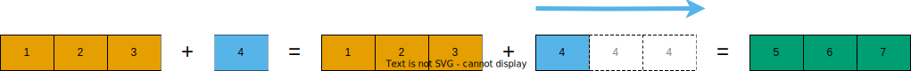
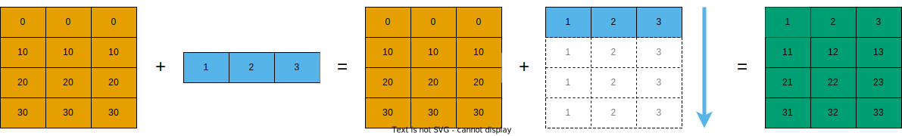
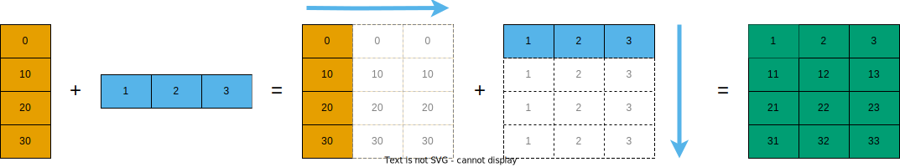
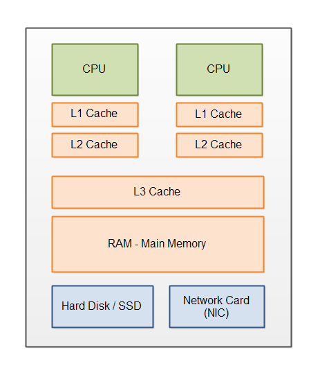

<!--
title: Lecture 03
paginate: true

_class: titlepage
-->

# Lecture 03
<br>

## Fast and curious
<br>

#### High Performance Computing for Data Science - SISSA, UniTS, 2023-2024

###### Pasquale Claudio Africa

###### 29 Apr 2024

---

# Outline

1. Scientific data types
2. Profiling and optimizing
3. Parallel computing
4. Performance boosting

Part of these notes is re-adapted from [this lecture](https://enccs.github.io/hpda-python/) and [this lecture](https://aaltoscicomp.github.io/python-for-scicomp/) ([license](LICENSE_CC-BY-4.0.md)).

---

<!--
_class: titlepage
-->

# Scientific data types

---

# Scientific Data

## Objectives

- Gain insights into various scientific data formats.
- Identify common issues when managing large datasets.
- Master the NetCDF format with Xarray.
- Evaluate the advantages and drawbacks of open science.
- Understand how to obtain a DOI for datasets or projects.

---

# Bits and bytes

The fundamental unit of data storage in computers is the **bit**, which can hold a value of 0 or 1. Typically, 8 bits are grouped together to form a **byte**. A single byte, consisting of 8 bits, can represent up to 256 different values. The organization of bytes can vary to encode different types of data.

## Numerical data

Bytes can represent various numerical data types, such as integers and floating-point numbers. Using more bytes per value increases the range and precision but also requires more memory. For instance, 1 byte (8 bits) can encode integers ranging from -128 to 127, while 2 bytes (16 bits) expand this range to -32768 to 32767. Unlike integers, floating-point numbers often suffer from representation errors because decimal fractions cannot always be precisely encoded in binary, leading to potential inaccuracies in calculations. To minimize errors, scientific computing often employs algorithms designed to prevent error accumulation, and floating-point numbers are typically stored using 8 bytes.

---

# Single vs. double precision

In fields like climate simulation, molecular dynamics, and machine learning, it is common to use single precision for parts of the modeling process to balance performance and accuracy cost effectively.

## Question
Have you ever opted for single precision in your models, and did it enhance performance?

---

# Text data

Initially, the ASCII (American Standard Code for Information Interchange) system, which uses 7 bits per character and encodes 128 specified characters, was widely used. Later, extended versions of ASCII utilized 8-bit bytes. As computational capabilities advanced and the demand to incorporate characters from various languages grew, UTF-8 became the dominant encoding system. UTF-8 employs 1 to 4 bytes per character, accommodating a broader array of characters.

---

# Data and storage formats (1/2)

In scientific applications, data tends to be complex and structured, often incorporating both numerical and textual information. Here we'll explore some common data and file storage formats used in the scientific community.

## Tabular Data

Tabular data, organized into named columns and rows, is a prevalent data type. Each row represents a distinct data sample, and columns are often labeled with names and specific data types. The most straightforward and widely used format for saving tabular data is the CSV (comma-separated values) file.

---

# Data and storage formats (2/2)

## Gridded data

Gridded data, typically saved in a multi-dimensional rectangular grid, is common in various scientific fields. This data is often stored in formats like:
- **HDF5 (Hierarchical Data Format 5)**: This format allows for the storage of large amounts of data in a structured manner, supporting multiple datasets in a single file.
- **NetCDF (Network Common Data Form)**: Particularly used for datasets that include spatial or temporal dimensions, facilitating the integration of metadata for efficient data handling.
- **Zarr**: A newer format optimized for cloud storage, providing efficient data manipulation and access.

---

# Binary files (1/2)

A binary file is a computer-readable file that stores data in binary format, not intended for direct human reading. Instead of text, these files contain binary data which computers can process more naturally and quickly.

## Characteristics of binary files

- **Non-human-readable**: Binary files consist of binary data, making them indecipherable without specialized software or tools.
- **Efficient processing**: Being in a format that computers natively understand, binary files can be processed faster, as there's no need for conversion between readable text and machine language.
- **Compact storage**: Binary files typically use less space than text files because they store information in a compact, byte-oriented manner.

---

# Binary files (2/2)

## Advantages
- **Speed**: Binary files are quicker to read and write because they are directly in the machine's language.
- **Precision**: They preserve the precision of data formats such as floating points without conversion errors.
- **Support for partial processing**: Many binary formats allow partial reading and writing, suitable for large data sets and streaming data.

## Disadvantages
- **Portability issues**: Differences in system architecture can affect the portability of binary files, such as variations in byte ordering (*endian issues*).
- **Complexity in handling**: Manipulating binary files typically requires understanding of their structure, which can be complex and less transparent than text files.

---

# Data handling: best practices (1/2)

Navigating through the multitude of file formats can be challenging. Here are some key considerations to keep in mind when handling data for your projects:

- **No one-size-fits-all solution**: Remember that no single file format excels in every scenario. Different tasks and requirements might necessitate different file formats.

- **Let your research guide you**: Often, the specific libraries and tools you plan to use for your research will dictate the most appropriate data format. Similarly, the data format you possess may influence the choice of file format for efficient data handling and analysis.

- **Adhere to established practices**: If you are working within a pre-existing framework, or your field has standard tools and formats, it's best to conform to these established practices. Utilizing familiar formats can facilitate easier collaboration and data sharing within your community.

---

# Data handling: best practices (2/2)

- **Optimize your starting point**: At the beginning of your project, consider taking your raw data, cleaning it, and saving it in a robust binary format. This not only sets a solid foundation for subsequent analysis but also ensures repeatability if you’ve scripted the cleaning process.

- **Maintain data readability**: While working on your project, use programming techniques to convert crucial data into human-readable forms, like visual plots, summary statistics, or the initial rows of a `pandas.DataFrame`. This approach helps in understanding and presenting data without needing to maintain the entirety of your dataset in a readable format.

- **Finalize with shareable formats**: Upon completing your project, choose a data format that simplifies the sharing process with others, ensuring that your findings are accessible and can be easily communicated to your intended audience.

---

# Open science

Open science advocates for the transparent and accessible sharing of scientific data and results, supporting broader dissemination and verification. However, it also faces challenges like potential information overload and misinterpretation by the public.

## FAIR Principles

The principles of Findability, Accessibility, Interoperability, and Reusability (FAIR) guide researchers in managing data effectively, ensuring that it is easy to locate, access, and use. These principles apply not only to data but also to research software, emphasizing good practices in data management.

## Obtaining a DOI for your project

You can make your git repository citable by archiving it on services like [Zenodo](https://zenodo.org/), [Figshare](https://figshare.com/), and many more, which assign a DOI (Digital Object Identifier) to your project, enhancing its visibility and traceability.

---

<!--
_class: titlepage
-->

# Profiling and optimizing

---

# Why can Python be slow?

When developing computer programs today, high-level, human-readable programming languages are typically used, which are then translated into the actual machine instructions that processors execute. This translation can occur in two primary ways:

- **Compiled languages**: The code is translated into machine language prior to execution using a compiler. This method generally results in more efficient execution but limits the flexibility of the program during runtime. The compilation process itself can be time-consuming, which may slow down the rapid testing and development cycle.
- **Interpreted languages**: The code is translated on-the-fly during execution by an interpreter. While this allows for more dynamic and flexible program behavior during runtime, it typically sacrifices performance.

Python falls into the category of interpreted languages, which facilitates rapid development due to its flexibility. However, this very flexibility often comes with the trade-off of decreased performance.

---

# Dynamic typing

Python is dynamically typed, meaning variables are only assigned a type at runtime when they are first assigned a value. This dynamic nature makes it challenging for the Python interpreter to optimize code execution as efficiently as a compiler, which can perform extensive analyses and optimizations beforehand. Although advancements in just-in-time (JIT) compilation techniques have improved runtime optimizations, Python's inherent dynamism still significantly impacts its performance.

# Flexible data structures

Python’s built-in data structures like lists and dictionaries are highly flexible, accommodating a wide variety of data types. However, this flexibility makes them less efficient for certain tasks, such as extensive numerical computations. The generic nature of these structures means there is considerable overhead involved when they are used for processing uniform data types.

---

# Python lists vs NumPy arrays


---

# Profiling

Once your code is working reliably, you can start thinking about optimizing it.

> **Warning:** Always measure the code before you start optimization. Don't base your optimization on theoretical considerations, otherwise you might be surprised.

Profiling is a key technique in software development used to analyze a program's execution to identify resource-intensive parts. It aids in pinpointing performance bottlenecks and provides insights into the runtime behavior of code components. Profiling involves various tools that measure aspects such as execution time, function call frequency, and resource usage. This process helps developers focus their optimization efforts effectively, enhancing the performance and efficiency of applications, especially in complex systems where issues may not be immediately obvious.

---

# time

An easy way to profile a program is to use the `time` function:

```python
import time

start_time = time.time()
# Code to profile.
a = np.arange(1000)
a = a ** 2
end_time = time.time()

print(f"Runtime: {end_time - start_time:.4f} seconds")

# Runtime: 0.0001 seconds
```

---

# Timeit

If you're using a Jupyter notebook, using `%timeit` to time a small piece of code is advisable:

```python
import numpy as np

a = np.arange(1000)

%timeit a ** 2
# 1.4 µs ± 25.1 ns per loop
```

For long-running calls, consider using `%time` instead of `%timeit`; it's less precise but faster.

---

# cProfile (1/2)

For more complex code, use the built-in Python profilers `cProfile` or `profile`:

```python
# walk.py
import numpy as np

def step():
    import random
    return 1. if random.random() > .5 else -1.

def walk(n):
    x = np.zeros(n)
    dx = 1. / n
    for i in range(n - 1):
        x_new = x[i] + dx * step()
        if x_new > 5e-3:
            x[i + 1] = 0.
        else:
            x[i + 1] = x_new
    return x

if __name__ == "__main__":
    n = 100000
    x = walk(n)
```

---

# cProfile (2/2)

```bash
python -m cProfile -s time walk.py
```

The `-s` switch sorts the results by time. Other options include e.g. function name, cumulative time, etc. However, this will print a lot of output which is difficult to read.

To save the profile to a file, use:

```bash
python -m cProfile -o walk.prof walk.py
```

The output file can be inspected with [`profile pstats module`](https://docs.python.org/3/library/profile.html#module-pstats) or profile visualisation tools like [Snakeviz](https://jiffyclub.github.io/snakeviz/) or [profile-viewer](https://pypi.org/project/profile-viewer/).

Similar functionality is available in interactive IPython or Jupyter sessions with the magic command `%%prun`.


---

# Line-profiler

While `cProfile` indicates which function takes the most time, it does not provide a line-by-line breakdown. For that, you can use [`line_profiler`](https://github.com/pyutils/line_profiler/). For line-profiling source files from the command line, we can add a decorator `@profile` to the functions of interests.

```bash
kernprof -l -v walk.py
```

In Jupyter:

```python
%load_ext line_profiler
%lprun -f walk -f step walk(10000)
```

---

# Line-profiler: sample output

```
Wrote profile results to walk.py.lprof
Timer unit: 1e-06 s

Total time: 0.113249 s
File: walk.py
Function: step at line 4

Line #      Hits         Time  Per Hit   % Time  Line Contents
==============================================================
   4                                           @profile
   5                                           def step():
   6     99999      57528.0      0.6     50.8      import random
   7     99999      55721.0      0.6     49.2      return 1. if random.random() > .5 else -1.
```

### Based on this output, can you spot a mistake which is affecting performance?

---

# Performance optimization

In software performance optimization, strategies can be broadly categorized into:

- **Algorithm optimization**: Focuses on improving the efficiency of the algorithms used, often by selecting more suitable data structures or algorithms that reduce computational complexity. This typically involves refining the logical structure of the code to perform fewer operations or more efficient ones.

- **CPU optimization**: Aims to enhance the way a program uses the processor's resources to increase execution speed. Techniques might include parallel processing, vectorization, or tuning the code to better fit the CPU's cache and pipelining features.

- **Memory optimization**: Deals with reducing the program's footprint in RAM to prevent memory leaks, reduce paging, and improve cache utilization of data. This can speed up the program by minimizing memory access times.

---

# Algorithm optimization (1/2)

The first step is to review the underlying algorithm. Consider if there are more efficient mathematical approaches or operations that could improve performance.

#### Example: Singular Value Decomposition (SVD)

```python
import numpy as np
from scipy import linalg
data = np.random.random((4000,100))

%timeit np.linalg.svd(data)
# 1.09 s ± 19.7 ms per loop (mean ± std. dev. of 7 runs, 1 loop each)

%timeit linalg.svd(data)
# 1.03 s ± 24.9 ms per loop (mean ± std. dev. of 7 runs, 1 loop each)

%timeit linalg.svd(data, full_matrices=False)
# 21.2 ms ± 716 µs per loop (mean ± std. dev. of 7 runs, 10 loops each)

%timeit np.linalg.svd(data, full_matrices=False)
# 23.8 ms ± 3.06 ms per loop (mean ± std. dev. of 7 runs, 10 loops each)
```

---

# Algorithm optimization (2/2)

#### Example: Fibonacci sequence

```python
# Recursion.
def fib_rec(n):
    if n < 2:
        return n
    return fib_rec(n-2) + fib_rec(n-1)

# Iteration.
def fib_iter(n):
    a, b = 0, 1
    for i in range(n):
        a, b = a + b, a
    return a

# Caching.
def fib_cached(n, cache={}):
    if n < 2:
        return n
    try:
        val = cache[n]
    except KeyError:
        val = fib_cached(n-2) + fib_cached(n-1)
        cache[n] = val
    return val
```

---

# CPU usage optimization (1/2)

#### Vectorization

Vectorization implies multiple operations being performed per clock cycle.

```python
import numpy as np
a = np.arange(1000)
a_dif = np.zeros(999, np.int64)
for i in range(1, len(a)):
    a_dif[i-1] = a[i] - a[i-1]

# 564 µs ± 25.2 µs per loop (mean ± std. dev. of 7 runs, 1 loop each)
```
```python
import numpy as np
a = np.arange(1000)
a_dif = a[1:] - a[:-1]

# 2.12 µs ± 25.8 ns per loop (mean ± std. dev. of 7 runs, 100,000 loops each)
```

---

# Vectorizing more complex functions

```python
import numpy as np
import math

def f(x, y):
    return math.pow(x, 3.0) + 4 * math.sin(y)

f_numpy = np.vectorize(f)

x = np.ones(10000, dtype=np.int8)
f_numpy(x, x)
```
```python
import numba # More about Numba in the next episode!

@numba.vectorize
def f(x, y):
    return x ** 3 + 4 * np.sin(y)

x = np.ones(10000, dtype=np.int8)
f(x, x)
```

---

# Memory usage optimization

#### Broadcasting

NumPy operations can be optimized using broadcasting, which allows operations between arrays of different sizes but compatible shapes.

**Example (1/3)**:

```python
import numpy as np
a = np.array([1, 2, 3])
b = 4
result = a + b
```



---

# Memory usage optimization

#### Broadcasting

NumPy operations can be optimized using broadcasting, which allows operations between arrays of different sizes but compatible shapes.

**Example (2/3)**:

```python
import numpy as np
a = np.array([[0, 0, 0],[10, 10, 10],[20, 20, 20],[30, 30, 30]])
b = np.array([1, 2, 3])
a + b
```



---

# Memory usage optimization

#### Broadcasting

NumPy operations can be optimized using broadcasting, which allows operations between arrays of different sizes but compatible shapes.

**Example (3/3)**:

```python
import numpy as np
a = np.array([0, 10, 20, 30])
b = np.array([1, 2, 3]) 
a + b # This does not work!
a[:, None] + b # Or: a[:, np.newaxis] + b
```



---

# Memory usage optimization

#### Cache effects (1/2)



---

# Memory usage optimization

#### Cache effects (2/2)

<div class="columns">

<div>


</div>

<div>

```python
c = np.zeros((10000, 10000), order='C')

%timeit c.sum(axis=0)
# 1 loops, best of 3: 3.89 s per loop

%timeit c.sum(axis=1)
# 1 loops, best of 3: 188 ms per loop

c.strides
# (80000, 8)
```

<div>

</div>

---

# Memory usage optimization

#### Temporary arrays

Optimize usage of temporary arrays in NumPy to avoid unnecessary memory consumption.

```python
a = np.random.random((1024, 1024, 50))
b = np.random.random((1024, 1024, 50))

# Two temporary arrays will be created.
c = 2.0 * a - 4.5 * b

# Four temporary arrays will be created, and from which two are due to unnecessary parenthesis.
c = (2.0 * a - 4.5 * b) + (np.sin(a) + np.cos(b))

# Solution: apply the operation one by one for really large arrays.
c = 2.0 * a
c = c - 4.5 * b
c = c + np.sin(a)
c = c + np.cos(b)
```

---

<!--
_class: titlepage
-->

# Parallel computing

---

<!--
_class: titlepage
-->

# Performance boosting

---

