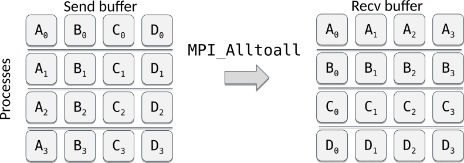

<!--
title: Lecture 04
paginate: true

_class: titlepage
-->

# Lecture 04
<br>

## Parallel universes
<br>

#### High Performance Computing for Data Science - SISSA, 2023-2024

###### Pasquale Claudio Africa

###### 30 Apr 2024

---

# Outline

1. Parallel computing paradigms
   - Multithreading
   - Multiprocessing
   - MPI
2. GPU computing
3. Using HPC resources

Part of these notes is re-adapted from [this lecture](https://enccs.github.io/hpda-python/) and [this lecture](https://aaltoscicomp.github.io/python-for-scicomp/) ([license](LICENSE_CC-BY-4.0.md)) and [this lecture](https://github.com/csc-training/hpc-python/tree/master) ([license](LICENSE_CC-BY-NC-SA-4.0.md)).

---

<!--
_class: titlepage
-->

# Parallel computing paradigms

---

# Introduction 
Do you realize that you need more computational power than a single processor can provide? What steps should you take?

1. Profile your application to pinpoint the actual performance bottlenecks.
2. Is it possible to optimize these slow areas? Could you integrate an existing library to help?
3. Are there straightforward optimizations that could be implemented with minimal effort?
4. Consider using tools like numba or cython to speed up critical functions.
5. Explore options for parallelizing your code.

In scientific computing, there is often a need to parallelize code, either because running computations on a single core takes too long or because certain hardware (like supercomputers) requires code to be parallelized to operate.

---

# Parallel computing paradigms (1/3)

Over the past ten years, the enhancement in CPU performance has largely been achieved through the addition of more cores, rather than through improvements in single-core performance. This trend emphasizes the importance of parallel processing, which leverages multiple CPU cores simultaneously, either through multithreading or multiprocessing.

Parallel computing is typically categorized into three main models:
1. **"Embarrassingly" parallel**: In this model, there is no need for synchronization or communication between instances. Multiple instances of the code can be run separately and their results combined later.

---

# Parallel computing paradigms (2/3)

2. **Shared memory parallelism (multithreading)**:
  - Threads perform separate tasks but communicate through shared memory and shared variables.
  - Due to the Global Interpreter Lock (GIL) in Python, multiple threads within the same Python program cannot execute simultaneously, limiting the effectiveness of multithreading to I/O-bound tasks.
  - External libraries written in languages like C, which are called from Python, can still effectively use multithreading.
  
---

# Parallel computing paradigms (3/3)

3. **Distributed memory parallelism (multiprocessing)**:
  - Each process manages its own memory segment and communicates with other processes as necessary through message passing.
  - A single process can contain one or more threads.
  - Processes can operate on different CPU cores or even on different computers.
  - The creation and destruction of processes are more resource-intensive than thread management.
  - Multiprocessing is particularly effective for CPU-bound tasks, which are computationally intensive.


---

<!--
_class: titlepage
-->

# Multithreading

---

# Multithreading and the GIL

Python's design includes a mechanism known as the Global Interpreter Lock (GIL), which allows only one thread to execute Python bytecode at a time within a process. This design choice means that some common multithreading approaches effective in languages like C, C++, or Fortran may not be effective in Python. However, there are still advantages to Python's approach to parallelism:
- **External libraries**: Libraries such as NumPy, SciPy, and Pandas, which are written in C or other languages, can release the GIL and operate in a multi-threaded manner.
- **I/O operations**: Most input/output operations release the GIL, which is beneficial since I/O operations are generally slow. The Python threading library can be utilized to multithread these I/O operations effectively.
- **Circumventing the GIL**: Python libraries like `multiprocessing` and `mpi4py` facilitate running multiple Python processes, thereby circumventing the GIL and allowing parallel processing without the single-thread limitation.

---

# Multithreading example (1/2)

Consider the following Python code, which performs a symmetrical matrix inversion on a large matrix using NumPy and measures the time taken for the operation:

```python
import numpy as np
import time

# Generate a random 4000x4000 matrix and make it symmetrical.
A = np.random.random((4000, 4000))
A = A @ A.T

start_time = time.time()
np.linalg.inv(A)
end_time = time.time()

print("Time spent for inverting A is", round(end_time - start_time, 2), 's')
```

---

# Multithreading example (2/2)

When this code is executed in a Jupyter notebook or a Python script, it will automatically utilize multithreading through OpenMP due to NumPy's configuration. This multithreading capability allows the matrix inversion to be completed more quickly by leveraging multiple CPU cores.

To run NumPy operations on a single thread, which typically leads to a longer runtime, you can set an environment variable to limit the number of threads used. The specific environment variable depends on NumPy's compilation settings on your system:

- For OpenMP implementations, use: `export OMP_NUM_THREADS=1`
- For Intel Math Kernel Library (MKL) implementations, use: `export MKL_NUM_THREADS=1`

Setting these variables forces NumPy to perform operations using only one thread, which can be useful for debugging or for comparing performance differences between single-threaded and multi-threaded operations.

---
# Multithreaded I/O (1/2)


From https://realpython.com/, distributed via a Creative Commons Attribution-NonCommercial-ShareAlike 3.0 Unported licence.

The `threading` library provides an API for creating and working with threads. The simplest approach to create and manage threads is to use the ThreadPoolExecutor class.

---

# Multithreaded I/O (2/2)

```python
import concurrent.futures

def download_all_sites(sites):
    with concurrent.futures.ThreadPoolExecutor(max_workers=4) as executor:
        executor.map(my_download_function, sites)
```


From https://realpython.com/, distributed via a Creative Commons Attribution-NonCommercial-ShareAlike 3.0 Unported licence.

---

<!--
_class: titlepage
-->

# Multiprocessing

---

# Multiprocessing

The `multiprocessing` module in Python provides a means to create processes using an API similar to that of the `threading` module. By using subprocesses instead of threads, this module effectively circumvents the Global Interpreter Lock (GIL), as each subprocess runs as an independent Python process.

---

# Multiprocessing example: using `Pool` objects (1/2)

One common approach to employing `multiprocessing` is through `Pool` objects, which can parallelize the execution of a function across multiple input values using the `Pool.map()` function, much like the threading approach.

```python
import multiprocessing as mp

def square(x):
    return x * x

if __name__ == '__main__':
    nprocs = mp.cpu_count()  # Number of CPU cores
    print(f"Number of CPU cores: {nprocs}")

    # Using a context manager to manage Pool resources
    with mp.Pool(processes=nprocs) as pool:
        result = pool.map(square, range(20))
    print(result)
```

---

# Multiprocessing example: using `Pool` objects (2/2)

This script calculates the square of numbers from 0 to 19 in parallel.

For functions that require multiple arguments, `Pool.starmap()` can be used.

```python
import multiprocessing as mp

def power_n(x, n):
    return x ** n

if __name__ == '__main__':
    nprocs = mp.cpu_count()  # Number of CPU cores
    print(f"Number of CPU cores: {nprocs}")

    with mp.Pool(processes=nprocs) as pool:
        result = pool.starmap(power_n, [(x, 2) for x in range(20)])
    print(result)
```

This example computes the power of numbers from 0 to 19 raised to the second power, demonstrating `Pool.starmap()`.

---

# Interactive environments and limitations

In interactive environments like Jupyter, the `multiprocessing.Pool` might not function as expected because the `__main__` module needs to be importable by child processes. A fork of multiprocessing, called multiprocess, is recommended for use in such environments.

The multiprocessing module also includes other functionalities like `Process` and `Queue`, which offer more control over individual processes.

Fortunately, there is a fork of `multiprocesssing` called `multiprocess` which does work in interactive environments. All we have to do is install it by pip install `multiprocess` and change the import statement: `from multiprocess import Pool`.

---

<!--
_class: titlepage
-->

# MPI

---

# Introduction to MPI

The Message Passing Interface (MPI) is a standardized and portable API used for communication among separate processes in a parallel computing environment. MPI offers exceptional portability and scalability, allowing the same code to run efficiently on both modest hardware and the most advanced supercomputers available.

Official MPI specifications provide C and Fortran interfaces, enhancing its adoption across various systems. For Python programmers, the unofficial [`mpi4py`](https://mpi4py.readthedocs.io) offers a convenient way to access MPI features.

---

# Key features of MPI

MPI is known for its extensive functionality, with over 300 procedures, although a typical application might only use a few. Here's a look at some of the core features MPI supports:

- **Process communication**: MPI excels in sending and receiving messages, whether between two or multiple processes.
- **Synchronization**: It provides mechanisms to synchronize operations across different processes.
- **Communicator management**: Communicators in MPI are critical as they define a group of processes that will communicate with each other.
- **Advanced features**: MPI also supports advanced operations like creating custom data types, one-sided communications, and parallel I/O.

---

# MPI execution model (1/2)

### How MPI works

An MPI program launches as multiple independent, identical processes, potentially spread across different CPUs or even different machines. These processes are interconnected, usually requiring a high-bandwidth, low-latency network to function optimally.

### MPI rank and communicators

Each process in an MPI program is assigned a unique identifier known as a *rank*. Ranks enable differentiation of tasks among processes:

```python
if rank == 0:
    # Task for rank 0
elif rank == 1:
    # Task for rank 1
else:
    # Tasks for all other ranks
```

---

# Data model

Since all MPI processes are completely independent, this means also a complete separation of data. Each process has its own separate memory space, i.e. all variables and data structures are local to the process. To exchange information, processes need to explicitly send and receive messages.


---

# MPI execution model (2/2)

A *communicator* in MPI is a group of processes that can interact with each other. All MPI processes belong to a global communicator by default (`MPI_COMM_WORLD`), but custom communicators can also be defined.

For anyone beginning with MPI, understanding how to query the number of processes and their ranks is essential. These are typically done using `Get_size()` and `Get_rank()` methods of a communicator:

```python
from mpi4py import MPI

comm = MPI.COMM_WORLD  # Global communicator
size = comm.Get_size()  # Number of processes
rank = comm.Get_rank()  # Unique identifier for this process

print(f"I am rank {rank} in a group of {size} processes")
```

---

# Running an MPI program

An MPI program is initiated using a launcher like `mpirun` or `mpiexec`, specifying the number of processes:

```bash
mpirun -np 4 python3 hello.py

I am rank 2 in group of 4 processes
I am rank 0 in group of 4 processes
I am rank 3 in group of 4 processes
I am rank 1 in group of 4 processes
```

---

# MPI communication

MPI processes are independent, requiring explicit messaging for coordination. This communication falls into two categories: point-to-point and collective. While collective communication involves multiple processes simultaneously and will be covered later, our focus here is on point-to-point communication between two processes.


---

# Point-to-point communication

Point-to-point communication involves one process sending a message to another process, which receives it. The crucial aspect is that every send operation must have a corresponding receive operation, and these must match not only in timing but also in specifying the correct source and destination ranks.

### Example: sending and receiving a dictionary

```python
from mpi4py import MPI

comm = MPI.COMM_WORLD
rank = comm.Get_rank()

if rank == 0:
    data = {'a': 7, 'b': 3.14}
    comm.send(data, dest=1)
elif rank == 1:
    data = comm.recv(source=0)
```

---

# Mechanics of sending and receiving

In MPI with Python, you can use `send()` and `recv()` methods from a communicator to exchange Python objects that are serializable via [pickle](https://docs.python.org/3/library/pickle.html). This includes most Python standard and derived objects.

- `.send(data, dest)`: Sends `data` to the process with rank `dest`.
- `.recv(source)`: Receives data from the process with rank `source`. The data is returned as the function's result.

These operations are **blocking**; they do not complete until it's safe to use the involved memory, necessitating successful coordination with the matching operation in the other process. Mismanagement can lead to deadlocks, where processes wait indefinitely for each other to send or receive data.

---

# Communication patterns


---


# Fast communication of large arrays

While MPI for Python allows for the sending and receiving of general Python objects, this flexibility can lead to performance issues due to the need to serialize and deserialize (pickle and unpickle) objects. For more efficient communication, especially of large data sets like NumPy arrays, MPI for Python provides specialized routines.

## Efficient NumPy array communication

The efficient communication of large arrays, such as NumPy arrays, utilizes routines in MPI for Python designed specifically for contiguous memory buffers, which avoid the overhead of serialization.

---

# Sending and receiving arrays

Using the upper case `Send()` and `Recv()` methods allows for direct memory copying, which is significantly faster for large data transfers.

Example of sending a NumPy array:

```python
from mpi4py import MPI
import numpy

comm = MPI.COMM_WORLD
rank = comm.Get_rank()

data = numpy.empty(100, dtype=float)
if rank == 0:
    data[:] = numpy.arange(100, dtype=float)
    comm.Send(data, dest=1)
elif rank == 1:
    comm.Recv(data, source=0)
```

---

# Combined Send and Receive

MPI also supports combined send and receive operations, which can reduce the risk of deadlocks:

```python
from mpi4py import MPI
import numpy

comm = MPI.COMM_WORLD
rank = comm.Get_rank()

data = numpy.arange(10, dtype=float) * (rank + 1)
buffer = numpy.empty(10, float)

if rank == 0:
    tgt, src = 1, 1
elif rank == 1:
    tgt, src = 0, 0

comm.Sendrecv(data, dest=tgt, recvbuf=buffer, source=src)
```

---

# Manual buffer definition

```python
from mpi4py import MPI
import numpy

comm = MPI.COMM_WORLD
rank = comm.Get_rank()

data = numpy.empty(100, dtype=float)
if rank == 0:
    data[:] = numpy.arange(100, dtype=float)
    comm.Send([data, 100, MPI.DOUBLE], dest=1)
elif rank == 1:
    comm.Recv([data, 100, MPI.DOUBLE], source=0)
```

This approach allows for communication of any type of contiguous data array using MPI's capabilities for high-performance data transfers.

---

# Non-blocking communication

MPI offers non-blocking communication routines that allow communication to occur in the background while the main program continues its execution. This approach can lead to more efficient code by overlapping computation with communication and reducing potential deadlocks.

## Key concepts

- **Non-blocking Methods**: Functions like `isend`, `irecv`, `Isend`, etc., start communication but return immediately, letting the program continue while the operation completes in the background.
- **Request Objects**: Non-blocking calls return a `Request` object, which is used to manage and check the status of the ongoing communication.

---

# Managing non-blocking communications (1/2)

### Finalizing communications

Non-blocking communications must be finalized using one of the following methods:

- **`wait()`**: A blocking call that waits for the specific communication to complete.
- **`test()`**: A non-blocking call that checks if the communication has finished and returns a boolean value.

---

# Managing non-blocking communications (2/2)

```python
from mpi4py import MPI
import numpy

comm = MPI.COMM_WORLD
rank = comm.Get_rank()
size = comm.Get_size()

if rank == 0:
    data = numpy.arange(size, dtype=float) * (rank + 1)
    req = comm.Isend(data, dest=1)
    # Other computations can be done here.
    req.wait()  # Wait for the send to complete.

elif rank == 1:
    data = numpy.empty(size, dtype=float)
    req = comm.Irecv(data, source=0)
    # Other computations can be done here.
    req.wait()  # Wait for the receive to complete.
```

---

# Handling multiple non-blocking operations

```python
from mpi4py import MPI
import numpy

comm = MPI.COMM_WORLD
rank = comm.Get_rank()
size = comm.Get_size()

data = numpy.arange(10, dtype=float) * (rank + 1)
buffer = numpy.zeros(10, dtype=float)

tgt = rank + 1 if rank < size - 1 else MPI.PROC_NULL
src = rank - 1 if rank > 0 else MPI.PROC_NULL

req = [comm.Isend(data, dest=tgt), comm.Irecv(buffer, source=src)]

MPI.Request.waitall(req)  # Wait for all requests to complete
```

---

# Overlapping computation and communication

Non-blocking communication can be effectively utilized to overlap data transfer with computation, enhancing the efficiency of parallel programs.


---

# Communicators in MPI

In MPI, a *communicator* is a fundamental object that groups processes for communication. It specifies the context in which MPI routines execute, allowing coordinated communication among sets of processes.

Each MPI process is part of a communicator and has a unique identifier (rank) within that communicator. Communicators dictate the scope and grouping of processes for communication tasks.


---

# User-defined communicators

While all processes initially belong to the default global communicator `MPI.COMM_WORLD`, MPI also allows the creation of custom communicators to better control communication flows and groupings.

### Creating custom communicators

A common use case for creating a custom communicator is to divide a large set of processes into smaller, more manageable groups based on certain criteria.

---

# Example: splitting communicators

```python
from mpi4py import MPI

comm = MPI.COMM_WORLD
rank = comm.Get_rank()

# Split processes by color grouping based on rank
color = rank % 4
local_comm = comm.Split(color)
local_rank = local_comm.Get_rank()

print(f"Global rank: {rank} Local rank: {local_rank}")
```

In this example, processes are divided into four groups (colors 0-3). Each group forms a new communicator, and within each, the processes are reassigned ranks starting from zero.

---

# Advantages of user-defined communicators

- **Isolation**: Custom communicators can isolate communication within specific groups of processes, improving efficiency and reducing interference.
- **Flexibility**: They allow more flexible management of processes based on the application's needs, such as dividing tasks that require different communication patterns.

---

# Collective communication: one to many

Collective communication in MPI facilitates data transfers among all processes within a communicator, streamlining data movement, collective computations, and synchronization. This type of communication requires involvement from all processes in the communicator, ensuring that data is uniformly sent or received.

## Benefits

- **Efficiency**: Collective communication is generally more efficient than equivalent point-to-point operations.
- **Simplicity**: It simplifies code, making it easier to maintain and understand.

---

# Communication Patterns

### Broadcast

The `Broadcast` or `Bcast` operation shares data from one process (the root) to all other processes in the communicator.


---

# Example: Broadcasting Data

```python
from mpi4py import MPI
import numpy

comm = MPI.COMM_WORLD
rank = comm.Get_rank()

if rank == 0:
    py_data = {'key1': 0.0, 'key2': 11}  # Python dictionary
    data = numpy.arange(8) / 10.0        # NumPy array
else:
    py_data = None
    data = numpy.zeros(8)

# Broadcast Python dictionary
new_data = comm.bcast(py_data, root=0)
# Broadcast NumPy array
comm.Bcast(data, root=0)
```

---

# Scatter

The `Scatter` operation divides data from one process and distributes it among all processes in the communicator.


---

# Example: Scattering Data

```python
from mpi4py import MPI
import numpy

comm = MPI.COMM_WORLD
rank = comm.Get_rank()
size = comm.Get_size()

if rank == 0:
    py_data = list(range(size))  # List of integers
    data = numpy.arange(size**2, dtype=float)  # NumPy array
else:
    py_data = None
    data = None

# Scatter list of integers
new_data = comm.scatter(py_data, root=0)
# Prepare a buffer for scattering NumPy array
buffer = numpy.empty(size, dtype=float)
# Scatter NumPy array
comm.Scatter(data, buffer, root=0)
```

---

# Collective communication: many to one

Collective communication routines in MPI not only facilitate data distribution but also collection from multiple processes to a single one. This discussion covers two primary MPI operations that enable such data collection: Gather and Reduce.

## Gather operation

The `Gather` operation collects data from all processes in the communicator and delivers it to a single designated process (root).


---

# Example: gathering data

```python
from mpi4py import MPI
import numpy

comm = MPI.COMM_WORLD
rank = comm.Get_rank()
size = comm.Get_size()

# Each process generates data based on its rank
data = numpy.arange(10, dtype=float) * (rank + 1)
# Buffer for gathering data at root
buffer = numpy.zeros(size * 10, dtype=float)

# Gather single values from each process
n = comm.gather(rank, root=0)
# Gather arrays from each process
comm.Gather(data, buffer, root=0)
```

---

# Reduce operation

The `Reduce` operation collects data from all processes, applies a specified operation (like sum, max, min), and stores the result in one process.


---

# Example: reducing data

```python
from mpi4py import MPI
import numpy

comm = MPI.COMM_WORLD
rank = comm.Get_rank()
size = comm.Get_size()

# Data array influenced by rank
data = numpy.arange(10 * size, dtype=float) * (rank + 1)
# Buffer for reduced data at root
buffer = numpy.zeros(size * 10, dtype=float)

# Sum all ranks
n = comm.reduce(rank, op=MPI.SUM, root=0)
# Sum all data arrays
comm.Reduce(data, buffer, op=MPI.SUM, root=0)
```

---

# Variants and flexibility

MPI also offers variations like `Scatterv` and `Gatherv` for operations involving variable amounts of data per process, enhancing flexibility in data distribution and collection.

---

# Collective communication: many to many

Collective communication in MPI not only involves one-to-one or many-to-one communications but also encompasses global interactions among all processes within a communicator. While these global communications are resource-intensive, they are crucial for certain parallel algorithms.

---

# Key operations

**Allreduce** combines the functionalities of Reduce and Broadcast. It performs a reduction operation (like sum, max, etc.) on data from all processes and then distributes the result back to all processes.

```python
from mpi4py import MPI
import numpy as numpy

comm = MPI.COMM_WORLD
rank = comm.Get_rank()
size = comm.Get_size()

# Data array influenced by rank
data = numpy.arange(10 * size, dtype=float) * (rank + 1)
buffer = numpy.empty(size * 10, dtype=float)

# Allreduce operation
result = comm.allreduce(rank, op=MPI.SUM)
comm.Allreduce(data, buffer, op=MPI.SUM)
```

---

# Key operations

**Alltoall** allows each process to send and receive data to and from every other process, effectively performing a matrix transpose of the data.



---

# Example: Alltoall Operation

```python
from mpi4py import MPI
import numpy as numpy

comm = MPI.COMM_WORLD
rank = comm.Get_rank()
size = comm.Get_size()

# Prepare data
py_data = list(range(size))
data = numpy.arange(size**2, dtype=float)

# Perform Alltoall
new_data = comm.alltoall(py_data)
buffer = numpy.zeros_like(data)
comm.Alltoall(data, buffer)
```

---

# Common mistakes in collective communication

1. **Incorrect conditional Callc**: Collective operations should not be called conditionally within a subset of processes.
   ```python
   if rank == 0:
       comm.bcast(...)
   ```
   This is incorrect because all processes must participate in the collective operation.
2. **Assuming synchronization**: Collective operations do not guarantee that all processes exit the call simultaneously. They only ensure that it is safe to proceed with the data.
3. **Buffer mismanagement**: Using the same buffer for both input and output can lead to unexpected results.

   ```python
   comm.Scatter(a, a, MPI.SUM)
   ```
   Use separate buffers for input and output to avoid overwriting data prematurely.

---

<!--
_class: titlepage
-->

# GPU computing

---

# GPU computing

Graphics Processing Units (GPUs) are becoming increasingly crucial in high-performance computing due to their ability to handle parallel computations more effectively than traditional CPUs. This article explores why and how to utilize GPUs for computing, focusing on their architecture, programming models, and appropriate use cases.

---

# Moore's law and the shift to multicore processing


---

# Moore's law and the shift to multicore processing

*Moore's law* suggests that the number of transistors on a chip doubles approximately every two years. However, due to power consumption limits, the increase in core frequency has stagnated, pushing the shift towards multicore processors around the mid-2000s to maintain performance growth.

## Why use GPUs?

GPUs, initially designed for rendering graphics, have evolved into powerful accelerators for general computational tasks. They offer significantly higher instruction throughput and memory bandwidth within a similar price and power envelope compared to CPUs.

---

# Differences between CPUs and GPUs


- **Design philosophy**: CPUs are optimized for fast execution of a sequence of operations (a thread), handling a few dozen parallel threads. GPUs excel in managing thousands of concurrent threads, making them ideal for data-parallel tasks.
- **Core allocation**: CPUs allocate more transistors for data caching and flow control, whereas GPUs dedicate more transistors to data processing.

---

# Performance strategies

Historically, performance gains in computer architecture have come from either boosting single-processor speeds or, more recently, increasing the number of physical cores.

## GPU architecture and programming model

Understanding GPU architecture and its programming model is essential for leveraging its capabilities effectively:

### GPU terminology

- **Host**: CPU
- **Device**: GPU
- **Kernels**: Functions executed on the GPU, launched by the host

---

# Numba for GPU Programming

[Numba](https://numba.pydata.org/) is a just-in-time compiler for Python that allows using GPU directly by compiling Python code into kernels that can run on the GPU. This simplifies GPU programming by abstracting away many of the complexities.

#### Example: Using Numba for vector addition

```python
from numba import vectorize, cuda
import numpy as np

@vectorize(['float32(float32, float32)'], target='cuda')
def add_vectors(a, b):
    return a + b

# Create data
a = np.array([1, 2, 3], dtype=np.float32)
b = np.array([4, 5, 6], dtype=np.float32)

# Compute result
c = add_vectors(a, b)
```

---

# Practical considerations for GPU computing

While GPUs are powerful, they require careful management of memory and computation strategies to be used effectively:

- **Memory transfers**: Data transfers between host and device should be minimized as they can become bottlenecks.
- **Execution strategy**: Kernels should be designed to maximize the occupancy of the GPU to improve performance.

---

<!--
_class: titlepage
-->

# Using HPC resources

---

# SLURM tutorial

SLURM (Simple Linux Utility for Resource Management) is a powerful cluster management and job scheduling system. In this tutorial, we will explore how to use SLURM for GPU computing, which is crucial for running computationally intensive tasks that benefit from GPU acceleration.

## Prerequisites

Before starting, ensure that:
- You have access to a cluster managed with SLURM.
- The cluster has nodes with GPUs installed.
- You have basic knowledge of Linux command line and job scripting.

---

# Basic SLURM commands

Here's a brief overview of basic SLURM commands you'll need:

- `sinfo`: View the status of nodes and partitions.
- `squeue`: Check the queue status and see all jobs currently scheduled on the cluster.
- `sbatch`: Submit a job script to the SLURM scheduler.
- `scancel`: Cancel a job.
- `srun`: Run a job interactively.

## Writing a job script for GPU uxsage

A job script tells SLURM what resources your job will need and the commands to execute the job. Below is an example script that requests GPU resources and runs a Python script using GPUs.

---

# Example job script

Here’s a simple job script (`my_job.sh`) to run a Python script on a GPU:

```bash
#!/bin/bash
#SBATCH --job-name=gpu-test           # Job name.
#SBATCH --partition=gpu               # Partition (job queue).
#SBATCH --gres=gpu:1                  # Number of GPUs per node.
#SBATCH --mem=4G                      # Memory needed per node.
#SBATCH --time=00-00:15:00            # Time limit days-hrs:min:sec.
#SBATCH --output=gpu-test_%j.log      # Standard output and error log.

module load python/3.8                # Load Python module.
module load cuda/10.2                 # Load CUDA module, adjust as per your cluster setup.

python my_gpu_script.py               # Run the Python script.
```

---

# Explanation

- `#!/bin/bash`: This shebang line starts the script in the Bash shell.
- `#SBATCH`: These lines contain SLURM directives:
  - `--job-name`: Sets the name of the job.
  - `--partition`: Specifies the partition.
  - `--gres`: Generic resources (gres) request; here, it requests GPUs.
  - `--mem`: Memory required.
  - `--time`: Maximum time after which the job will be terminated.
  - `--output`: Filename for the job output.
- `module load`: Loads the necessary modules. Modules might include software, compilers, or libraries.
- `python my_gpu_script.py`: Executes the Python script using GPU.

---

# Submitting a job

To submit the job to the cluster, use:

```bash
sbatch my_job.sh
```

After submitting, you can monitor the job status with `squeue`.

## Interactive GPU jobs

For debugging or testing, you might want to run commands interactively on a GPU. You can request an interactive session with:

```bash
srun --partition=gpu --gres=gpu:1 --pty bash
```

---

# Checking GPU usage

While your job is running, you can check GPU utilization using `nvidia-smi`, which provides detailed statistics about GPU usage.

## Tips for effective computing

1. **Efficient use of resources**: Ensure that your code is optimized for parallel/GPU usage. Not all tasks are suitable, particularly those that are not highly parallelizable.
2. **Resource requests**: Request only the resources you need. Over-requesting leads to inefficiencies in cluster usage.
3. **Monitoring and profiling**: Regularly monitor and profile your jobs to understand their resource utilization and optimize accordingly.

---

<!--
_class: titlepage
-->

# :tada: That's all Folks!
